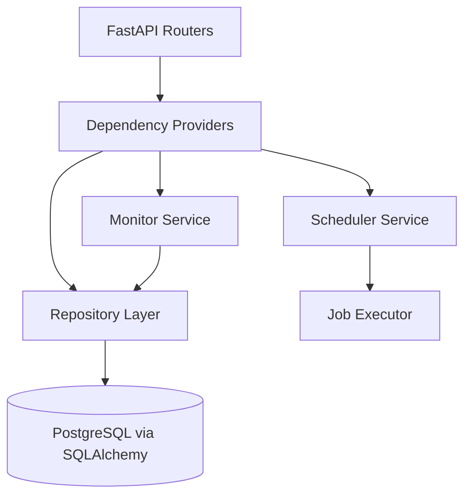

# WebIntel AI

WebIntel AI is an async-first website intelligence service built with FastAPI. It provides APIs for managing tasks/jobs/monitors, runs scheduler jobs, and tracks monitor snapshots for change detection.

## Architecture



## Repository layout

- `services/app/app/main.py` – FastAPI application factory.
- `services/app/app/api/routers/` – CRUD APIs for tasks, jobs, and monitors.
- `services/app/app/services/` – scheduler, monitoring, and in-memory repository services.
- `services/app/app/db/` – SQLAlchemy models, async session helpers, and DB interfaces.
- `services/app/tests/` – async/unit API tests.
- `infrastructure/helm/webintel/` – Helm chart skeleton.

## Run locally

```bash
cd services/app
python -m uvicorn app.main:app --reload
```

## Test locally

```bash
pytest services/app/tests -q
```

## Notes

- API routers now use FastAPI dependency injection (`Depends`) rather than direct module-level globals.
- The default runtime wiring still uses an in-memory repository for local development/tests.
- SQLAlchemy async models and Alembic migration scaffolding are included for PostgreSQL-backed deployments.
